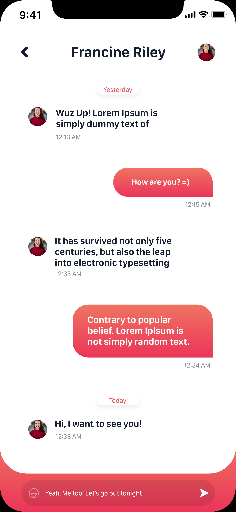

# Chat - DatingApp

App concept created with android using flutter programming language, inspired by [Chat - DatingApp.](https://www.uplabs.com/posts/chat-datingapp) design found on uplabs.

## About
The app was created to simulate all the system behind the UI kit in the link. There's no code on backend or other web service. The app is all contained in this repository. The models classes was created to better representate an official development, the repositories classes simulate a web request.

## The Inspiration
The images below shows the inspiration concept of the app.

Listing Screen 

  

Detail Screen

  

## Design Details
As exposed on the inspiration images, there's all the design details also present in this app.

## Notes
To be completed
